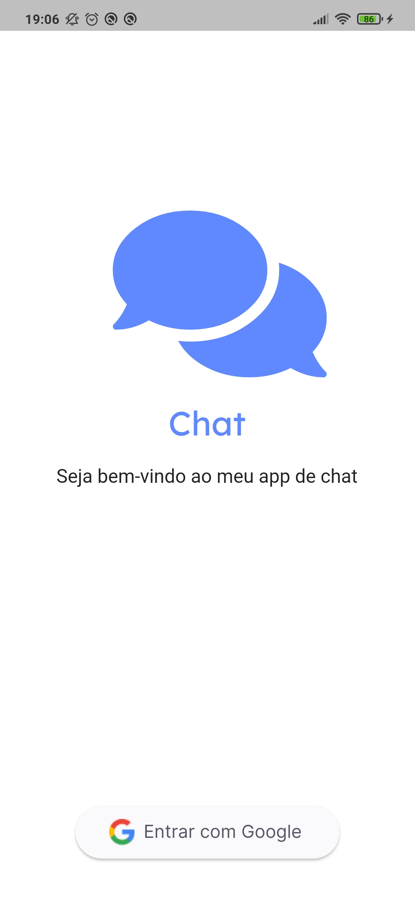
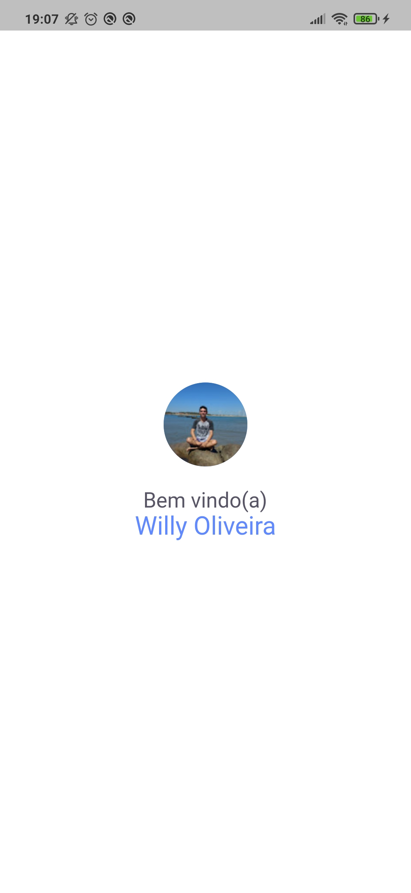
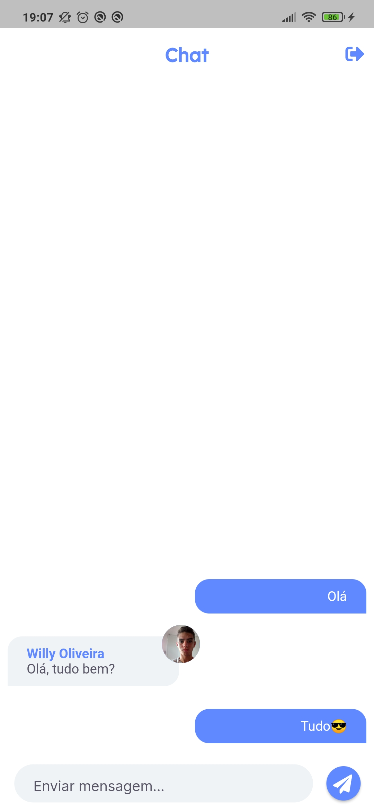

# Chat


Tabela de conteúdos
=================
<!--ts-->
   * [Sobre o projeto](#-sobre-o-projeto)
   * [Layout](#-layout---páginas)
   * [Como executar o projeto](#-como-executar-o-projeto)
     * [Pré-requisitos](#pré-requisitos)
     * [Rodando o Aplicativo](#-rodando-o-aplicativo)
   * [Tecnologias](#-tecnologias)
<!--te-->


## 💻 Sobre o projeto

Este projeto consiste em um simples aplicativo de chat construído em Flutter e que possui integração com o Firebase. O app funciona de forma bem simples, o usuário efetua o login com sua conta Google e apartir de efetuado o login ele pode acessar a área para enviar mensagens. O app utiliza o Firebase tanto para guardar as mensagens quanto para a autenticação do usuário, além disso ele trabalha por com gerência de estado por meio da lib Provider.

---

## 🎨 Layout - Páginas
 O app possui três páginas bem simples, sendo elas:
 * Página de login
 * Página de bem-vindo
 * Chat

<p align="center"> 
  
  
  
</p>

---

## 🚀 Como executar o projeto
Abaixo são apresentados os passos necessários para que o App funcione.

### :page_with_curl: Pré-requisitos

Antes de começar, você vai precisar ter instalado em sua máquina as seguintes ferramentas:
[Git](https://git-scm.com), [Flutter](https://flutter.dev/docs/get-started/install). 
Além disto é bom ter um editor para trabalhar com o código como [VSCode](https://code.visualstudio.com/).<br/>
O projeto utiliza o [Firebase](https://firebase.google.com/) para o processo de autenticação e para guarda os dados das mensagens. Deviso isto, é necessário a criação do projeto no Firebase, permitir autenticação e fazer as devidas alterações no projeto.<br/>
#### Abaixo os passos necessários para integrar com o Firebase:
<!--ts-->
   * [Criar o projeto](https://console.firebase.google.com/)
   * Permitir a autenticação com o Google
     * Acesse o menu Authetication e ative a autenticação com o Google     
   * Criar o banco de dados
     * A partir do menu Firestore Database, crie o banco de dados que será utilizado no projeto
   * Criar o app Android
     * Link para a documentação https://firebase.google.com/docs/android/setup?hl=pt
<!--te-->
OBS: Para utilizar a autenticação do Google com o Firebase é necessário gerar a chave SHA e adicionar no app android criado no Firebase. No link no tópico acima também explica como gerar e adicionar a chave.

#### 🎲 Rodando o Aplicativo

```bash

# Clone este repositório
$ git clone https://github.com/willyoliv/chat.git

# Acesse a pasta do projeto no terminal/cmd
$ cd chat

# Instale as dependências
$ flutter pub get

# Execute a aplicação 
$ flutter run


```

---

## 🛠 Tecnologias

As seguintes ferramentas foram usadas na construção do projeto:

- [Flutter](https://flutter.dev/)


